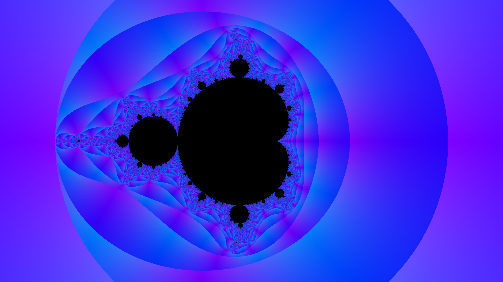
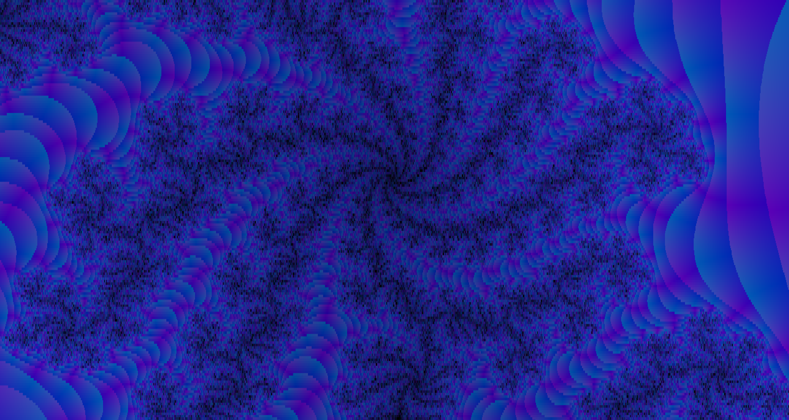

# Fractal-Drawer

## General
This is a simple fractal renderer I made while being bored. For now it just draws **Mandelbrot Set** and allows primitive panning and zoom. 
It can't do much of anything else yet but I intend to make it more flexible, perhaps other fractals, some color tweaking, etc. 
I would also want to make it handle infinite or near infinite zoom, but I do not know how yet.

## Controls
Move around the canvas with a mouse, **TAB** to switch trivial rendering and perturbation-based rendering

## Known Issues
Not a lot seeing as this is really small project.
Anyway:
 - Overall shittiness
 - Terrible precision even at relatively small zooms
 - No UI or way of changing parameters outside source code whatsoever

## Imagery

#### And here is the precision drop

